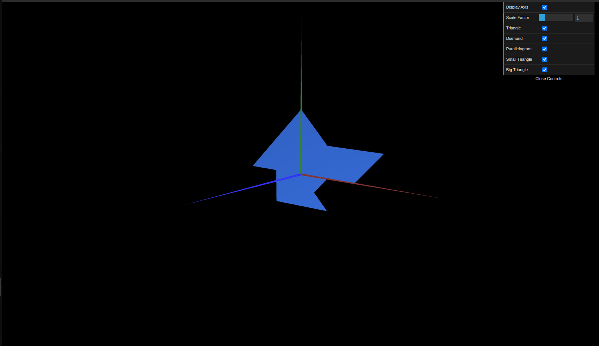

# CG 2024/2025

## Group T13G03

## TP 1 Notes

- In exercise 1 we learned how to draw geometric shapes and how the order of the points affects their visibility
- In exercise 2 we built upon our previous knowledge with different cases

