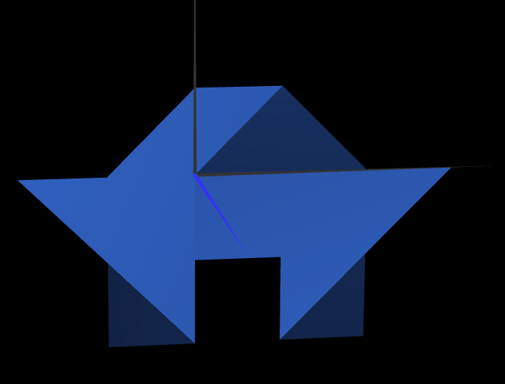
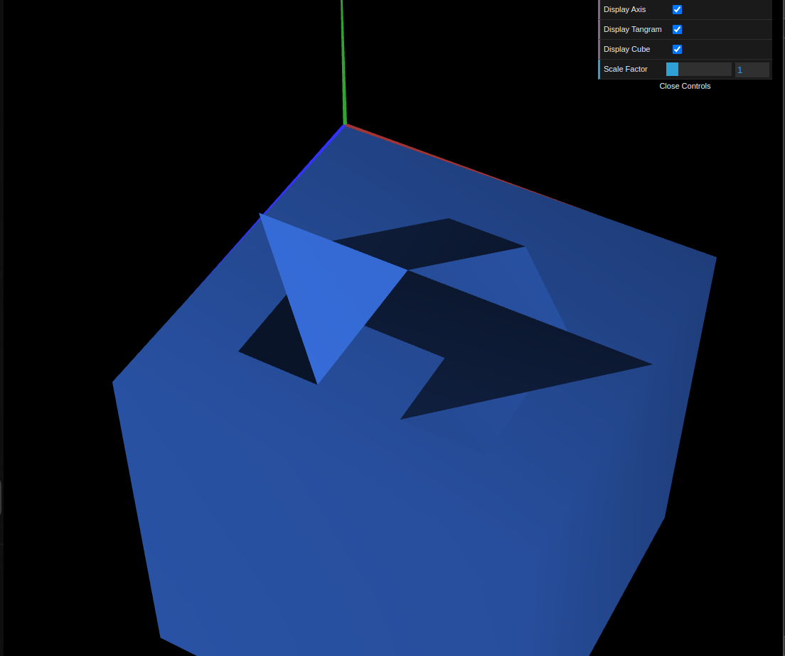
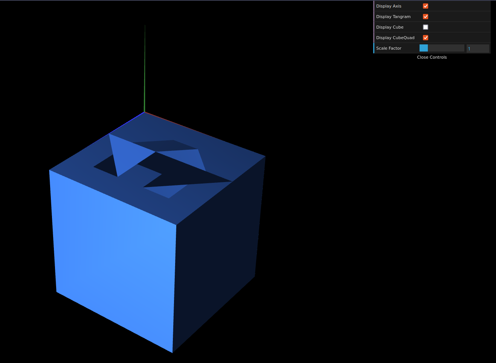

# CG 2024/2025

## Group T13G03

## TP 2 Notes

- In exercise 1 we used the shapes created in the previous class to recreate a given Tangram puzzle configuration via matrix transformations.

- In exercise 2 we created a unitary cube that served as a base for the Tangram we created, and placed it according to the instructions.

- In exercise 3 we created a unitary square that was used to recreate the previously developed cube by making each of the cube's faces seperately. We then replaced the original cube with the new one.

