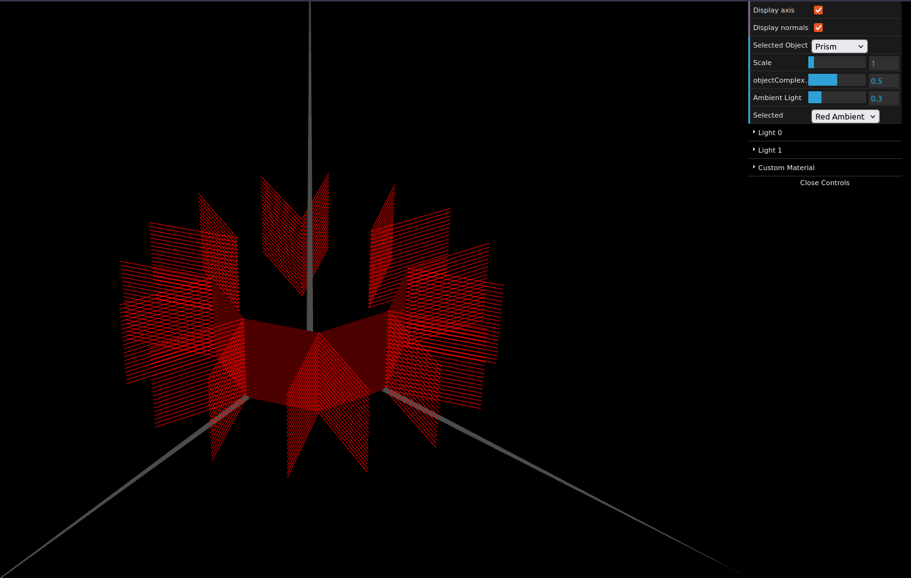

# CG 2024/2025

## Group T13G03

## TP 3 Notes

- In Part 1 we learned how to work with different materials and lighting configurations, and how to apply them to objects.

- In Part 2 we created a prism object with a custom number of slices and stacks, taking special care to ensure the normals were correctly calculated.

- In Part 3 we modified the prism object and reworked it's normals to create a new object, a cylinder.

