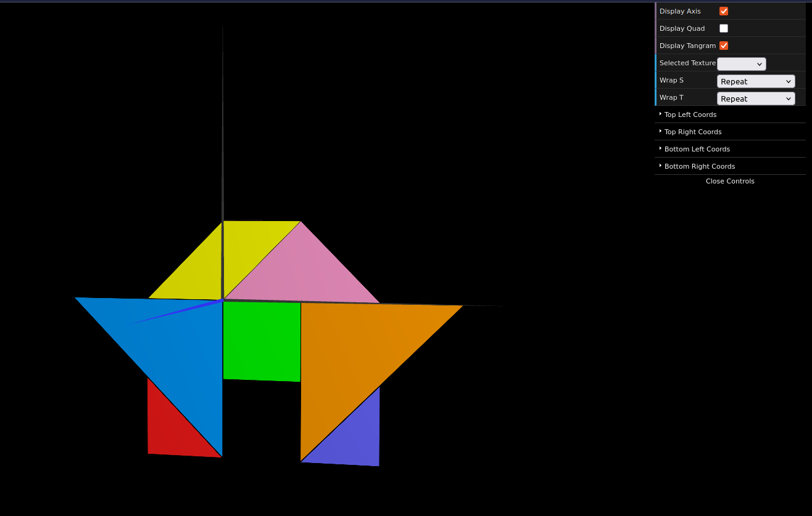
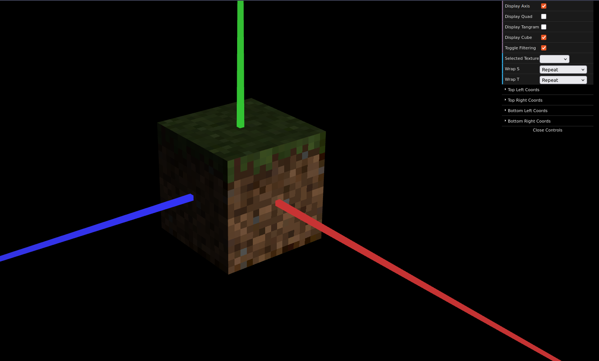

# CG 2024/2025

## Group T13G03

## TP 4 Notes

- In exercise 1, we used a single tangram texture file and applied it to each corresponding piece by calculating the correct texture coordinates.

- In exercise 2, we used applied different textures to the faces of a cube, and changed the filtering of said textures to enhance their quality.

