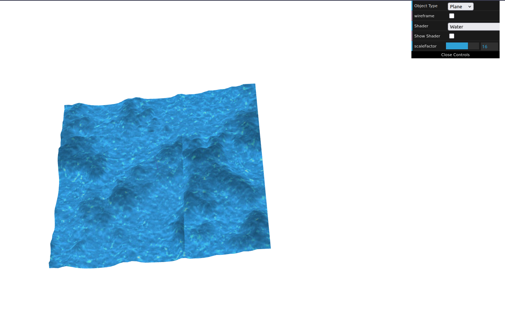

# CG 2024/2025

## Group T13G03

## TP 4 Notes

- In exercise 1, we created shaders to render the teapot with the color yellow whenever y was greater than 0.5, and blue otherwise.

- We also used shaders to alter the rgb components of the teapot's applied texture, giving it a grayscale effect.

- In exercise 2, we created shaders to simulate water ripples on a plane, using a map texture to displace the vertices and simulate water depth.

